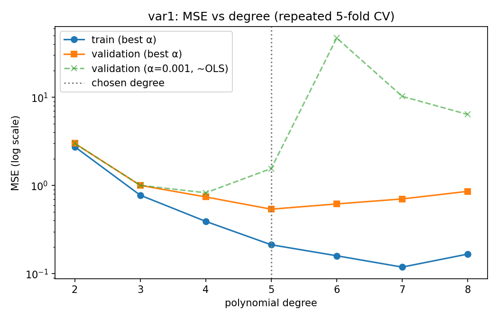
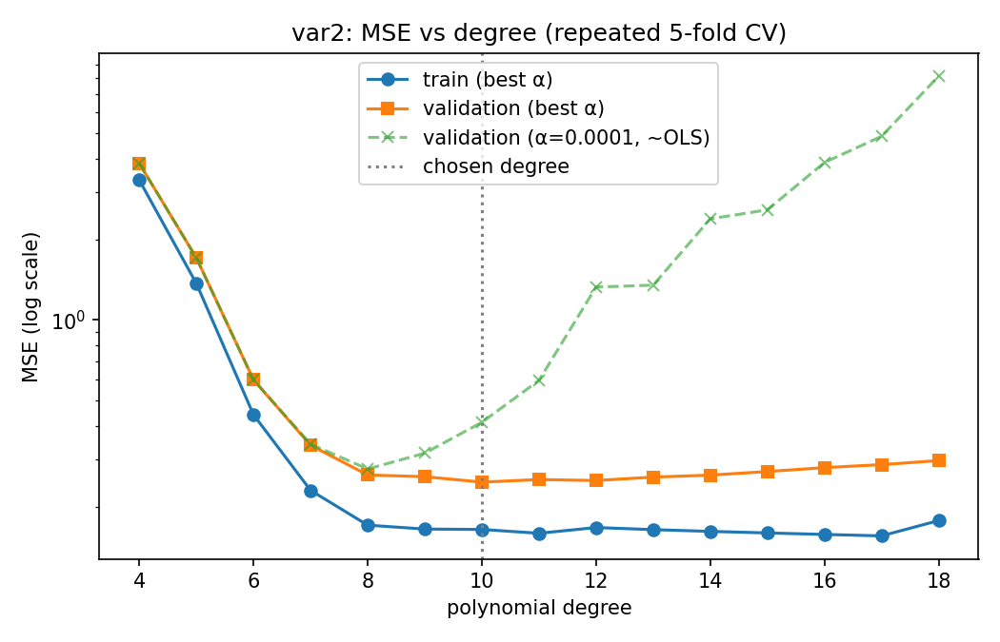
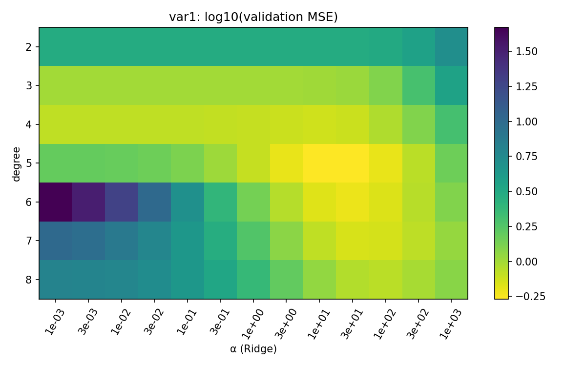
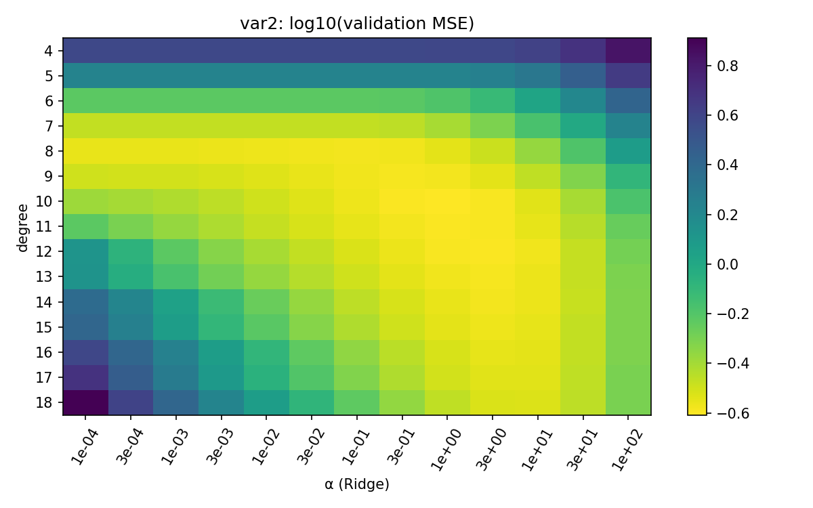

# ML Assignment 1 — Polynomial Regression

**Roll No:** BT2024199

This repo fits polynomial regression models to two datasets (`var1` with 6 features, `var2` with 3) and predicts `y` for the held-out test sets.

## Approach

Each model is a three-step pipeline:

```
PolynomialFeatures(degree)  →  StandardScaler  →  Ridge(alpha)
```

- **Model selection:** grid search over `(degree, alpha)` using **repeated 5-fold CV** (3 repeats, seed 42), picking the lowest validation MSE.
- **Regularisation:** with all the cross terms, high degrees have many features. Ridge keeps those models stable where plain OLS would overfit or become ill-conditioned.
- **Covariate-shift check (var1):** the `var1` test set has many more features clipped at ±1 than the training set. `shift_var1.py` reweights training rows by the distribution of clipped-feature counts and recomputes the validation MSE with those weights. It picks the same model as plain CV, so the final choice holds up under the shift.

## Results

| Problem | Degree | α (Ridge) | # terms | CV val MSE | CV val R² | Full-train R² |
|---|---|---|---|---|---|---|
| var1 | 5 | 31.62 | 461 | 0.5395 ± 0.0669 | 0.9471 | 0.9786 |
| var2 | 10 | 1.0 | 285 | 0.2468 ± 0.0243 | 0.9947 | 0.9965 |

Weighting for the shift (var1): the best setting is still degree 5, α = 31.62. Its weighted validation MSE is 0.628 when fitted without weights and 0.675 when fitted with weights, so the final model is fitted without weights.

### Plots

| | var1 | var2 |
|---|---|---|
| MSE vs degree |  |  |
| log₁₀(val MSE) over degree × α |  |  |

## Repository structure

| File | Purpose |
|---|---|
| [`train.py`](train.py) | **Final pipeline.** Runs the grid-search CV, saves the plots and CV tables, and writes the prediction files. |
| [`explore.py`](explore.py) | Dataset statistics and an unregularised (OLS) degree sweep showing the bias–variance trade-off. |
| [`refine.py`](refine.py) | Ridge degree sweep plus a drop-one-feature ablation. |
| [`diagnose_shift.py`](diagnose_shift.py) | Compares clipping between train and test, and checks how much test predictions change across candidate models. |
| [`shift_var1.py`](shift_var1.py) | Model selection for var1 using validation MSE weighted for the shift. |
| `BT2024199_train_var{1,2}.csv` | Training data (1000 rows each). |
| `BT2024199_test_var{1,2}.csv` | Test features (1000 rows each). |
| `BT2024199_pred_var{1,2}.csv` | **Submitted predictions** (one column, `y`). |
| `results/` | CV grids (`cv_var*.csv`), shift analysis (`shift_var1.csv`) and plots. |
| [`report/report.tex`](report/report.tex) | LaTeX report documenting methodology, CV results, and rationale. |

## How to run

```bash
python -m venv venv
# Windows: venv\Scripts\activate    |    macOS/Linux: source venv/bin/activate
pip install -r requirements.txt

python train.py            # final models + predictions + plots
python explore.py          # optional: exploration
python refine.py           # optional: ridge sweep + ablation
python diagnose_shift.py   # optional: train/test shift diagnostics
python shift_var1.py       # optional: shift-weighted selection for var1
```

The scripts find their data files relative to their own location, so you can run them from any directory.
